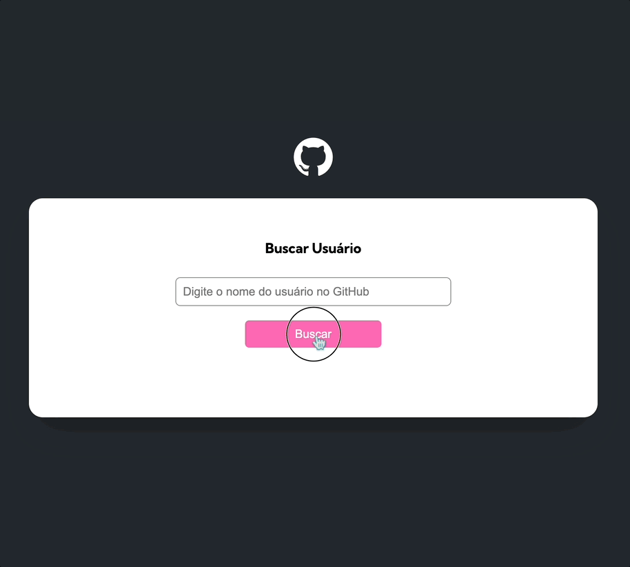

# Fetch Github API 🔎

Projeto criado como forma de avaliar o aprendizado de JavaScript no curso DevQuest. 👾

## Objetivo 🎯

O objetivo deste projeto é criar um formulário que recebe o nome de um usuário do GitHub e exibe suas informações, repositórios e atividades recentes.

## Requisitos 📝

- O formulário deve ter um campo de entrada para o nome de um usuário do GitHub.

- Quando o formulário for enviado, o nome do usuário deve ser buscado na API do GitHub.
  - Caso o botao seja clicado sem digitar o nome de um usuário, uma mensagem de erro deve ser exibida na tela.
  - Caso o usuário não seja encontrado, uma mensagem de erro deve ser exibida na tela.

- As informações do usuário devem ser exibidas na tela.
  - Avatar
  - Nome (caso não houver, mostrar uma mensagem indicando isso)
  - Biografia (caso não houver, mostrar uma mensagem indicando isso)
  - Quantidade de seguidores
  - Quantidade de seguindos
  - Quantidade de repositórios

- Os repositórios do usuário devem ser exibidos na tela (caso não houver, mostrar uma mensagem indicando isso).
  - Nome
  - Link
  - Quantidade de forks
  - Quantidade de estrelas
  - Quantidade de watchers
  - Linguagem (caso não houver, mostrar uma mensagem indicando isso)

- As atividades recentes do usuário devem ser exibidas na tela (caso não houver, mostrar uma mensagem indicando isso).
  - Nome do repositório
  - Tipo de evento
  - Mensagem de commit se o evento for do tipo 'PushEvent'
  - Mensagem diferente se o evento for do tipo 'CreateEvent'

## Tecnologias utilizadas 🛠️

- HTML

- CSS

- JavaScript

- API
  - [GitHub API](https://docs.github.com/en/rest)

## Aprendizado 📚

- Aprendi a organizar melhor meus scripts em:
  - index (arquivo principal, contém o formulário e a chamada das funções)
  - variables (arquivo que contém variáveis globais)
  - objects (pasta que contém objetos e armazenam seus dados e métodos)
  - services (pasta que contém funções que fazem as chamadas das APIs e seus respectivos tratamentos)

- Pratiquei a exportação e importação de variáveis, objetos e funções entre arquivos.

- Pratiquei a utilização de objetos para armazenar dados e métodos importantes para o projeto. Exemplo:

  ``` javascript
  const userData = {
    avatarUrl: "",
    name: "",
    bio: "",
    userName: "",
    followers: 0,
    following: 0,
    repositoriesQuantity: 0,
    repositories: [],
    events: [],
    setInfo(githubUser) {
        this.avatarUrl = githubUser.avatar_url;
        this.name = githubUser.name;
        this.bio = githubUser.bio;
        this.userName = githubUser.login;
        this.followers = githubUser.followers;
        this.following = githubUser.following;
        this.repositoriesQuantity = githubUser.public_repos;
    },
    setRepositories(repos) {
        this.repositories = repos;
    },
    setEvents(events) {
        this.events = events;
    }
  } 
  ```

- Pratiquei a utilização da propriedade `innerHTML` para alterar o conteúdo de elementos HTML, além de métodos como `appendChild`, `replaceWith`, `createElement` e `CreateTextNode`. Exemplo:

  ``` javascript
    renderEvents(events) {
		  this.profileData.innerHTML += `
            <div class="events section">
                <h2>Eventos</h2>
                ul id="events-list"></ul>
            </div>`;
		  const eventsList = this.profileData.querySelector("#events-list");

		  if (events.length === 0) {
			  const p = document.createElement("p");
			  p.textContent = "Este usuário não possui nenhuma atividade recente.";
			  eventsList.replaceWith(p);
			  return;
		  }

		  for (const event of events) {
			  const li = document.createElement("li");
			  const strong = document.createElement("strong");
			  strong.textContent = event.repo.name;

			  li.appendChild(strong);
			  li.appendChild(
				  document.createTextNode(
					  event.type === "PushEvent"
						  ? ` - ${event.payload.commits[0].message}`
						  : " - Sem mensagem de commit",
				  ),
			  );

			  eventsList.appendChild(li);
		  }
    }

  ```

## Preview do site 👀


